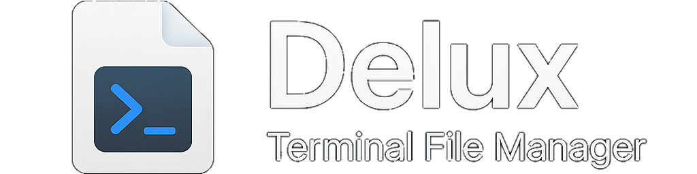

<p align="center">
  
</p>

# 🧾 Delux Terminal File Manager

**Delux** is a lightweight, terminal-based file manager that runs on `dialog`. It supports interactive folder navigation, file operations, and script execution – all within a simple TUI (text user interface).

---

## ✅ Features

- 📁 Navigate folders (with hidden files support)
- 📝 Edit, delete, or rename any file
- 🖼️ Media files: delete or rename
- 🧨 Executables: confirm before deleting
- 🐚 `.sh` shell scripts: auto `chmod +x` + execute on `Open`
- 🔙 Return to parent folder with `Go back`

---

## 💻 Supported OS

| OS         | Supported | Notes                         |
|------------|-----------|-------------------------------|
| 🐧 Linux    | ✅        | Works on most distributions   |
| 🍎 macOS    | ✅        | Requires [Homebrew](https://brew.sh/) for `dialog` |
| 📱 Termux   | ✅        | Fully compatible on Android   |

---

## 📦 Installation

### 1. Install Dependencies

#### Linux (Debian/Ubuntu)
```bash
sudo apt install dialog
```
#### macOS (via Homebrew)
```bash
brew install dialog
```
#### Termux
```bash
pkg install dialog
```

## ⚙️ Clone and Run
#### Linux
```bash
git clone https://github.com/xStrikea/delux.git
cd delux/bash
chmod +x delux_linux.sh
./delux_linux.sh
```
#### MacOS
```bash
git clone https://github.com/xStrikea/delux.git
cd delux/bash
chmod +x delux_mac.sh
./delux_mac.sh
```
#### Termux
```bash
git clone https://github.com/xStrikea/delux.git
cd delux/bash
chmod +x delux_termux.sh
./delux_termux.sh
```